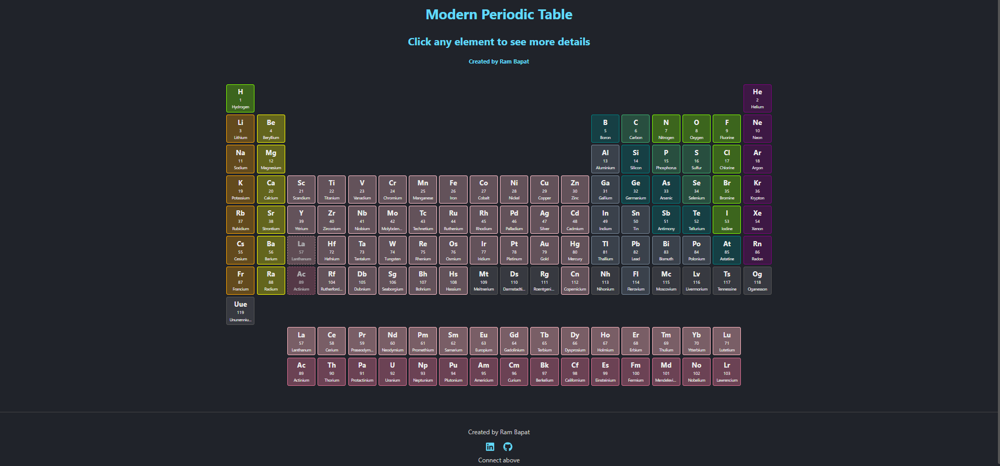
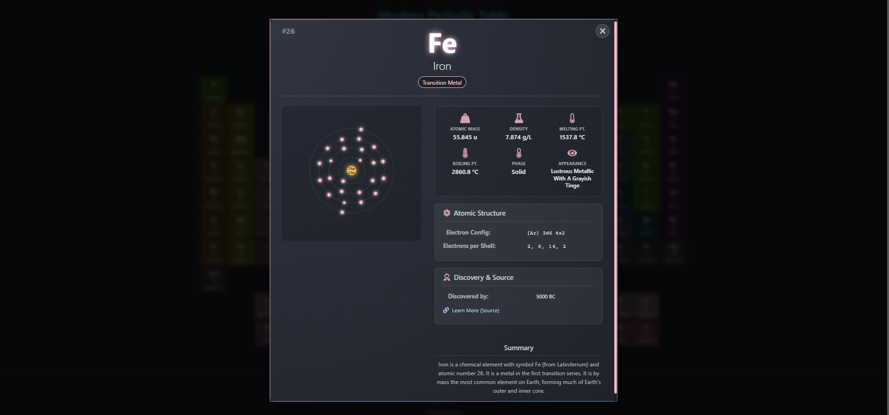
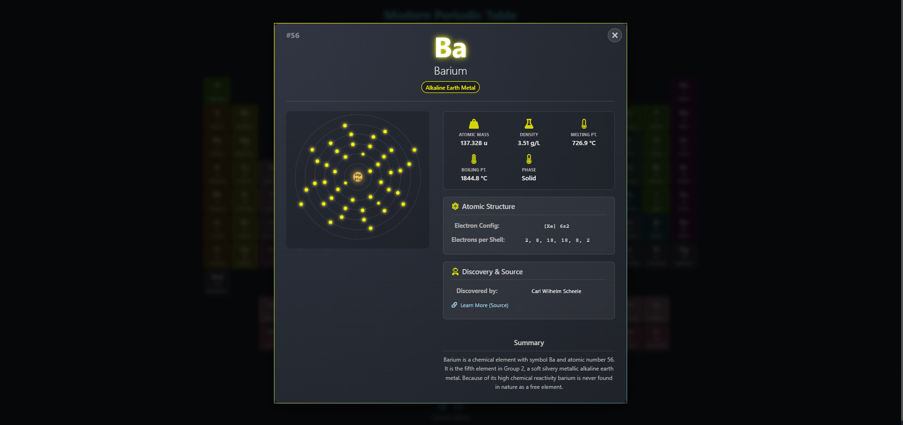

# Modern & Visual Periodic Table (React) ✨⚛️

A highly visual and interactive periodic table application built with React and Vite, designed to make learning about the elements engaging and intuitive.

<!-- ================================================== -->
<!-- === Screenshots === -->





<!-- ================================================== -->

## Overview

This project presents the periodic table in a modern web interface. Users can browse the elements arranged in the standard grid layout. Clicking on any element reveals a detailed modal card featuring:

*   Key atomic information (mass, density, phase, melting/boiling points, etc.).
*   Discovery details and a link to more information.
*   A visually appealing, animated Bohr model representation of the element's electron shells.
*   A summary of the element's properties.
*   Theming based on the element's category (e.g., Alkali Metal, Noble Gas).

The goal is to provide a creative and visually stimulating alternative to traditional periodic tables.

## Features

*   **Interactive Grid:** Elements displayed using CSS Grid, accurately reflecting standard periodic table layout, including Lanthanide and Actinide series placeholders.
*   **Clickable Elements:** Each element tile is interactive.
*   **Detailed View:** A modal card opens upon clicking an element, showing comprehensive data.
*   **Animated Bohr Model:** A dynamic CSS-based visualization of the nucleus and electron shells/orbits within the detail card.
*   **Category Theming:** Element tiles and detail cards are color-coded based on element categories for easy identification.
*   **Responsive Design:** The layout adapts reasonably well to different screen sizes.
*   **Data-Driven:** Element information is loaded from a local JSON file (`elements.json`).
*   **Modern Tech Stack:** Built with React, Vite for fast development, and modern CSS features.
*   **Iconography:** Utilizes `react-icons` for a cleaner UI in the detail card and footer.

## Tech Stack

*   **Frontend:** React 18+
*   **Build Tool:** Vite
*   **Styling:** CSS3 (including Flexbox, Grid, Custom Properties/Variables, Animations)
*   **Language:** JavaScript (ES6+)
*   **Icons:** `react-icons`
*   **Package Manager:** npm

## Getting Started

To get a local copy up and running, follow these simple steps.

### Prerequisites

*   Node.js (which includes npm) installed on your system. You can download it from [nodejs.org](https://nodejs.org/).
*   Git (for cloning the repository).

### Installation & Setup

1.  **Clone the repository:**
    ```bash
    git clone https://github.com/Barrsum/Modern-Visual-Periodic-Table.git
    ```

2.  **Navigate to the project directory:**
    ```bash
    cd Modern-Visual-Periodic-Table
    ```

3.  **Install NPM packages:**
    ```bash
    npm install
    ```

### Running the Project

1.  **Start the development server:**
    ```bash
    npm run dev
    ```
    This command will start the Vite development server.

2.  **Open the application:**
    Open your web browser and navigate to the local URL provided by Vite (usually `http://localhost:5173/` or a similar port).


## Contributing

Contributions, issues, and feature requests are welcome! Feel free to check the [issues page](https://github.com/Barrsum/Modern-Visual-Periodic-Table/issues).

1.  Fork the Project
2.  Create your Feature Branch (`git checkout -b feature/AmazingFeature`)
3.  Commit your Changes (`git commit -m 'Add some AmazingFeature'`)
4.  Push to the Branch (`git push origin feature/AmazingFeature`)
5.  Open a Pull Request

## License

Distributed under the MIT License. See `LICENSE.md` for more information.

## Acknowledgements

*   **Element Data:** Sourced from [Periodic-Table-JSON](https://github.com/Bowserinator/Periodic-Table-JSON) by Bowserinator.
*   **Icons:** Provided by [React Icons](https://react-icons.github.io/react-icons/).
*   **React:** [react.dev](https://react.dev/)
*   **Vite:** [vitejs.dev](https://vitejs.dev/)

---

Built by Ram Bapat - [LinkedIn Profile](https://www.linkedin.com/in/ram-bapat-barrsum-diamos)
